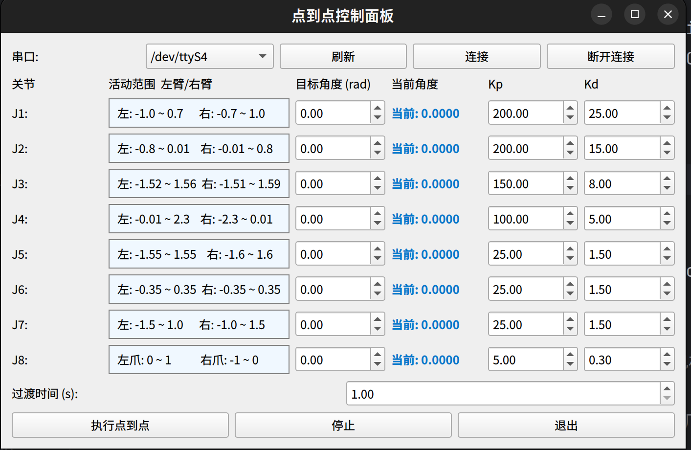
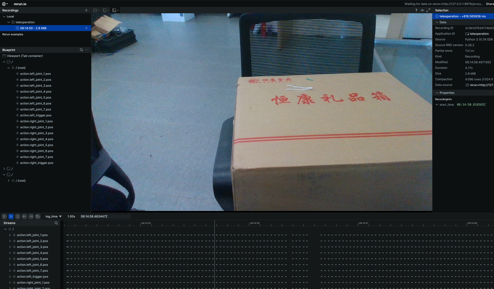
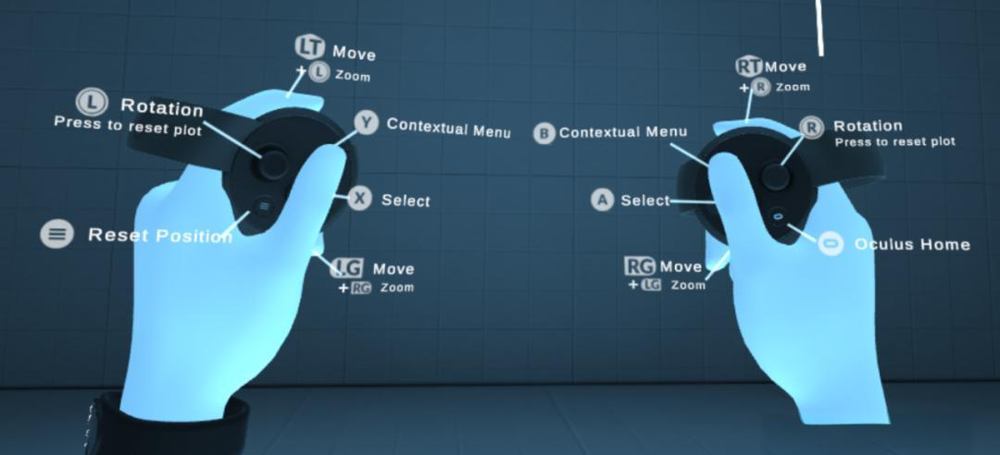
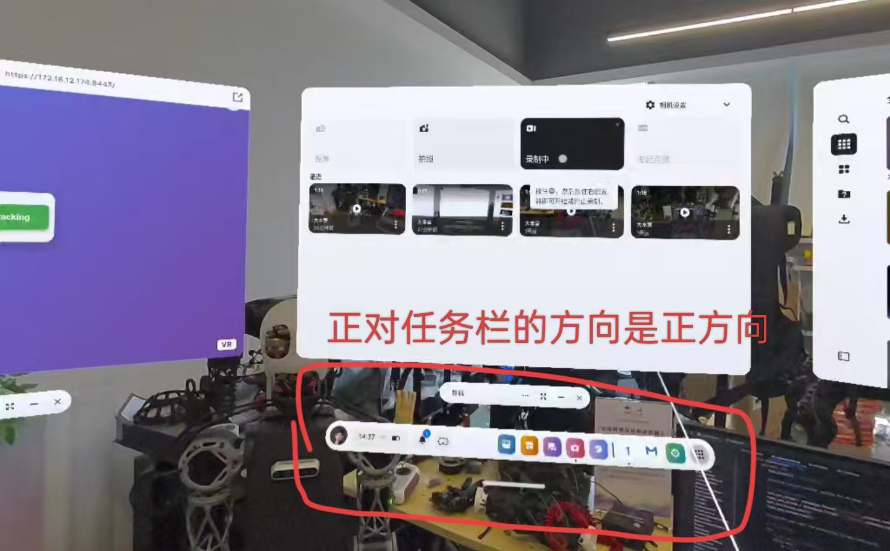
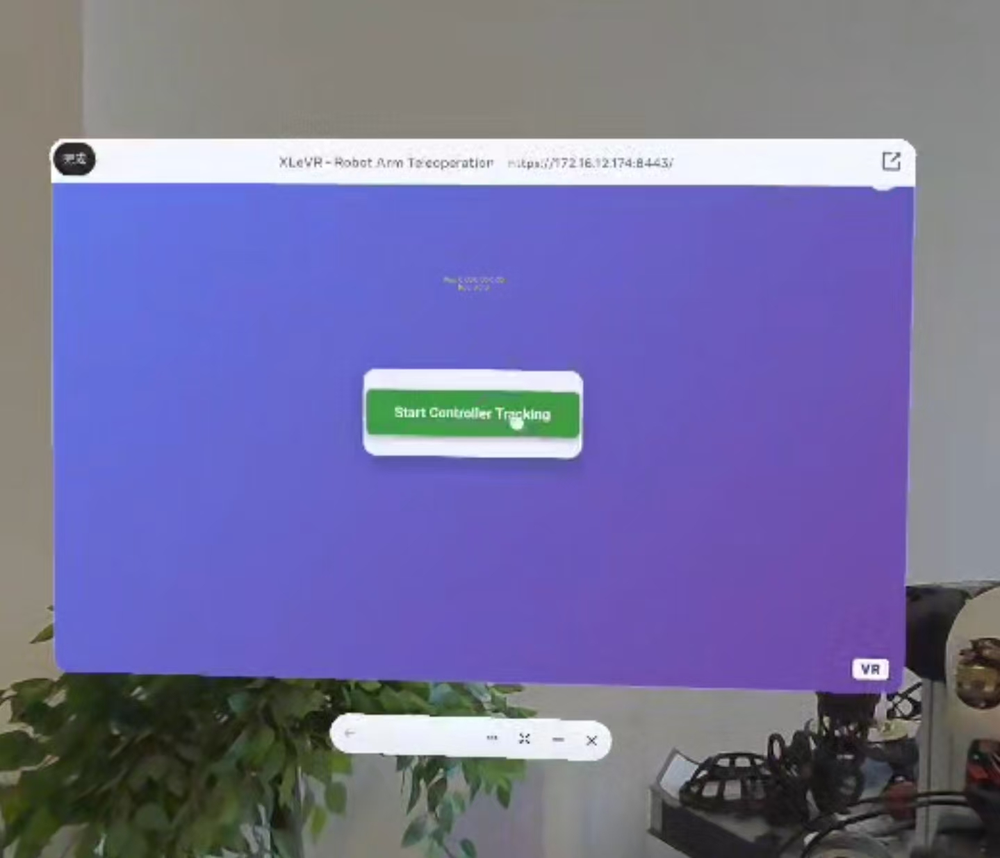
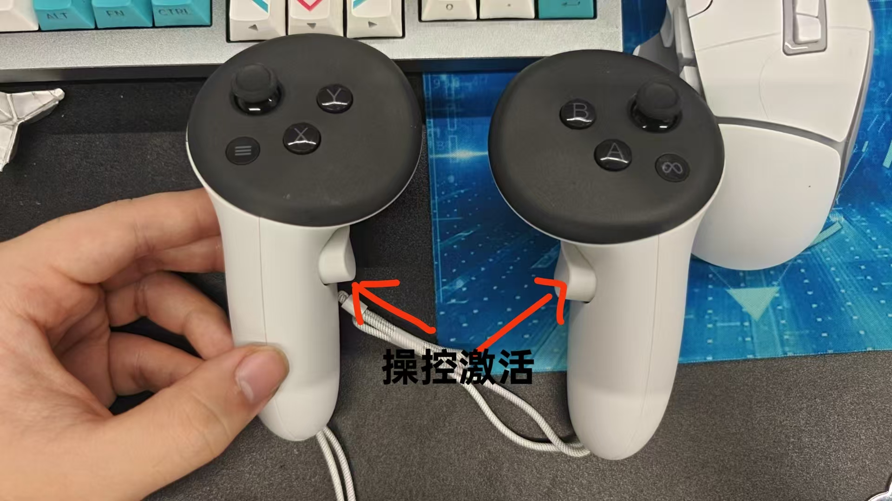
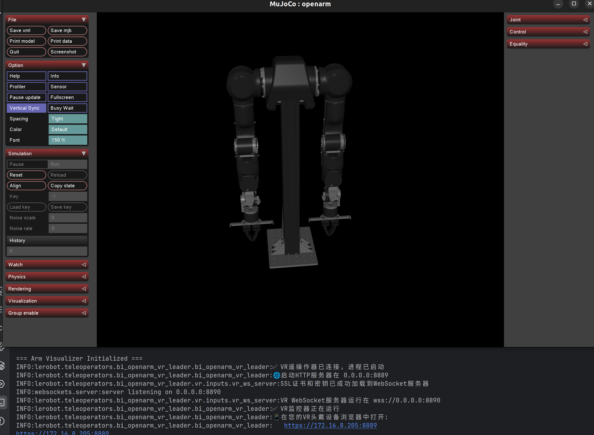

# VR遥操作使用说明

在lerobot4.2的基础上 加入自定义的机器人和遥操作设备，符合lerobot 官方接口

## 快速开始

创建环境

```
conda create -n lerobot python=3.10.18 ffmpeg=7.1.1 -c conda-forge
```

将库安装为可编辑模式 

```
git clone https://github.com/2252031668/lerobot_alter.git
cd lerobot_alter
pip install -e .
```

```
pip3 install pin
pip3 install socket
pip3 install websockets
pip3 install mujoco
pip3 install PyQt5
```

其中 pin 为动力学库 ，用于 ik 计算  在ubuntu 下安装比较方便，window容易报错


## 查看硬件端口

运行check_serial_GUI.py，判断左臂还是右臂

```
conda activate lerobot
cd lerobot_alter
python3 check_serial_GUI.py
```



注：ubuntu要设置端口权限如下

```
sudo chmod 666 /dev/ttyACM0
```

## VR遥操作

已经接入lerobot，满足所有通用操作

### 不带摄像头的遥操作

left_port，right_port，ROOT_PATH需要根据自己的情况来，在conda环境下

```bash
lerobot-teleoperate \
  --teleop.type=bi_openarm_vr_leader \
  --teleop.ROOT_PATH="/home/wxx/PycharmProjects/lerobot4_alter/src/lerobot/teleoperators/bi_openarm_vr_leader" \
  --robot.type=bi_openarm_follower \
  --robot.left_port="/dev/ttyACM0" \
  --robot.right_port="/dev/ttyACM1" \
  --robot.id=vr_bimanual_robot \
  --teleop.id=vr_controller \
  --display_data=true \
  --fps=30 
```

-   --display_data= true 会显示关节轨迹数据可视化界面,默认为false
-   --teleop.https_port =8889  可以设置网页端口，默认8889
-   --teleop.websocket_port = 8890 监听的地址，默认8890,不要修改，如要改vr_app.js中的内容要手动修改端口
-   --teleop.https_port = "0.0.0.0 "可以设置ip地址，默认0.0.0.0 会自动获取本机ip

### 带摄像头的遥操作

查找普通相机：

```
lerobot-find-cameras opencv
```
查找inter深度相机
```
lerobot-find-cameras realsense
```

会自动显示相机的id 和并拍摄照片保存在output文件夹

设置相机参数

```bash
lerobot-teleoperate \
  --teleop.type=bi_openarm_vr_leader \
  --teleop.ROOT_PATH="/home/wxx/PycharmProjects/lerobot4_alter/src/lerobot/teleoperators/bi_openarm_vr_leader" \
  --robot.cameras="{ center: {type: intelrealsense, serial_number_or_name: 944622075590, width: 1280, height: 720, fps: 30}}" \
  --robot.type=bi_openarm_follower \
  --robot.left_port="/dev/ttyACM0" \
  --robot.right_port="/dev/ttyACM1" \
  --robot.id=vr_bimanual_robot \
  --teleop.id=vr_controller \
  --display_data=true \
  --fps=30  
```


可以添加多个相机，不同的分辨率，具体可调节参数查看lerobot 官方https://huggingface.co/docs/lerobot/en/il_robots

```bash
--robot.left_arm_config.cameras='{
wrist: {"type": "opencv", "index_or_path": 1, "width": 640, "height": 480, "fps": 30},
}' --robot.right_arm_config.cameras='{
wrist: {"type": "opencv", "index_or_path": 2, "width": 640, "height": 480, "fps": 30},
}' \
```

### VR 头戴显示 注意事项

在主界面的时候，可以移动手柄控制 射线指针，按住**LT** 或者 **RT** 就是对指针的确认键



通过 点按右边遥柄的**home** 按键，可以开机/关闭任务栏，从而做到根据你的站立的的位置，重置方向。



打开VR浏览器访问ip网页或者预设好的快捷网页访问，每次重新启用遥操作，都要刷新或者关闭重新打开网页，然后**正对你之前正方向进行操作。**




按键事件无需操控激活，x，y按键也可以添加预设动作或位置

- B：移动到预设位置
- A：电机失能，用于紧急停止和退出控制




#### 控制逻辑相对运动

建议按B：移动到预设位置 之后在进行激活操控

按住侧边按键进行操控激活，激活状态下可以使用夹爪和移动控制，即每次按住侧边按键进行操控激活，都是**相对运动**记录的开始


结束后按a 结束控制

如果异常退出导致端口占用，手动查询清除

```
lsof -i :8889  
sudo kill -9 #清除对应进程
```

## mujoco仿真

编辑位于src/lerobot/teleoperators/bi_openarm_vr_leader 文件下的mujoco_control.py，

```python
    config = BiOpenarmVRLeaderConfig(
        ROOT_PATH = "/home/wxx/PycharmProjects/lerobot4_alter/src/lerobot/teleoperators/bi_openarm_vr_leader",# 必须修改绝对路径，指向bi_openarm_vr_leader目录
        https_port = 8889, #默认为8889，可以不填
        websocket_port = 8890,   #默认为8890 可以不填 如果修改需要手动修改vr_app.js中的websocket_port
        host_ip = "0.0.0.0", #默认为0.0.0.0，会自己获取，可以不填
    )
```

必须在bi_openarm_vr_leader目录下运行

```
conda activate lerobot
cd src/lerobot/teleoperators/bi_openarm_vr_leader
python3 mujoco_control.py
```



## VR遥操作+数据记录

指令参考https://huggingface.co/docs/lerobot/en/il_robots

```
lerobot-record \
```


